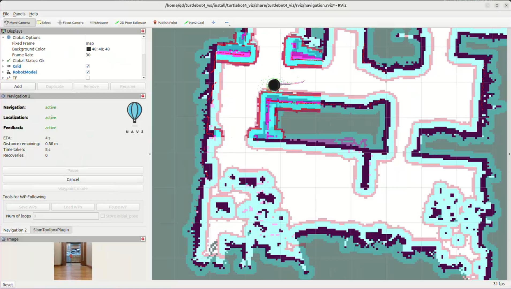

# Demo

## 1. Baseline

This is the baseline behavior of the system before enabling the costmap perception layer with the camera-lidar fusion pipeline.

## 2. With Costmap Perception Layer

Coming soon.